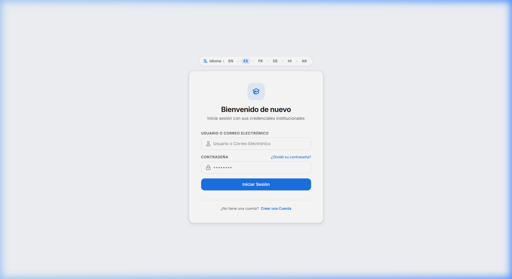
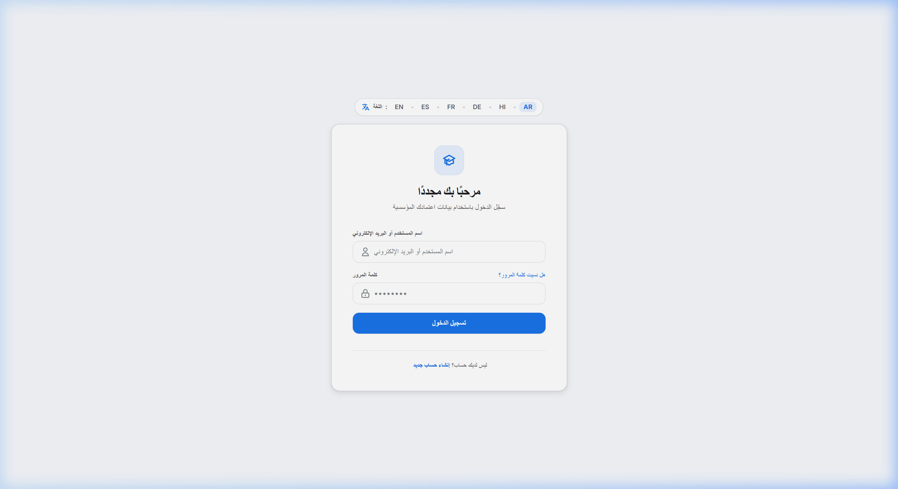
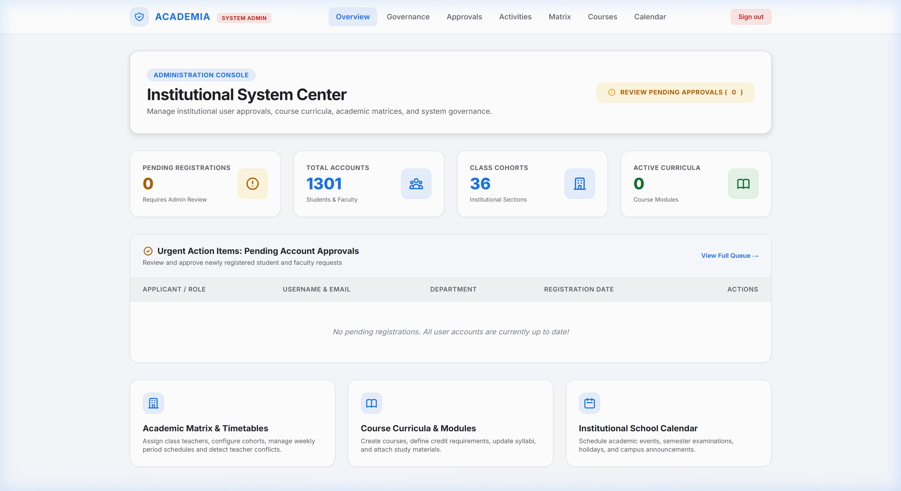
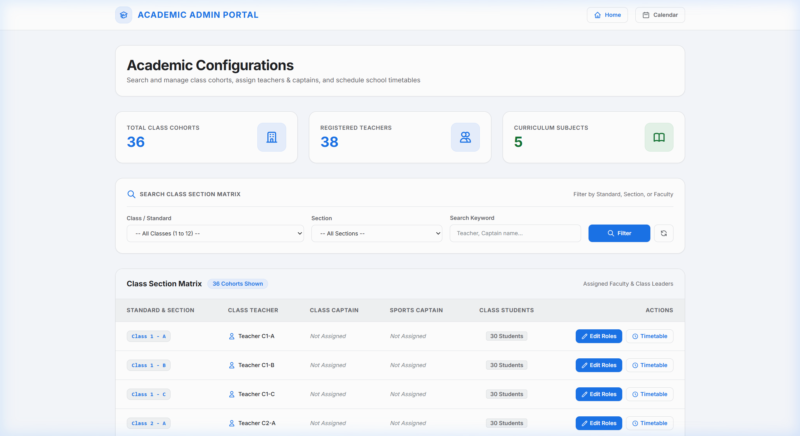
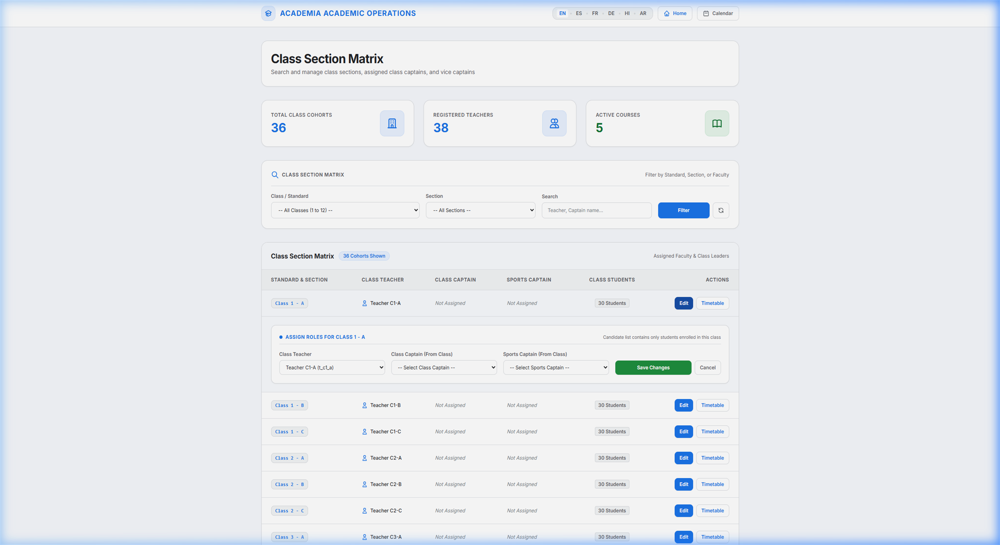
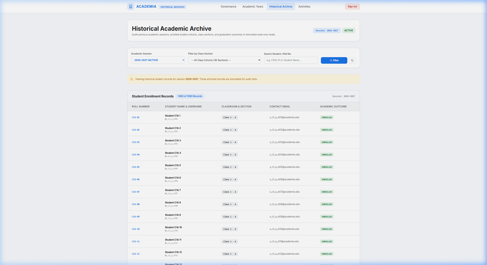
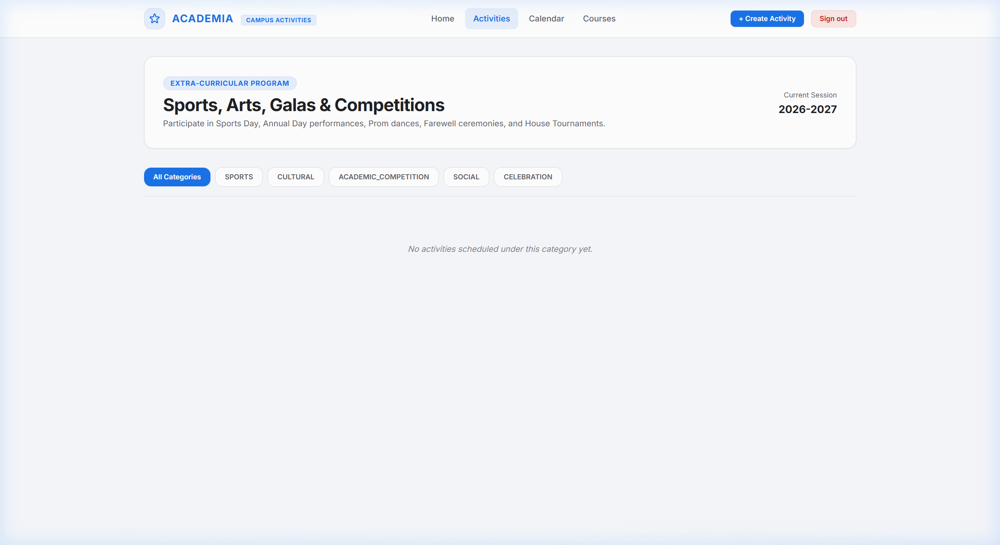
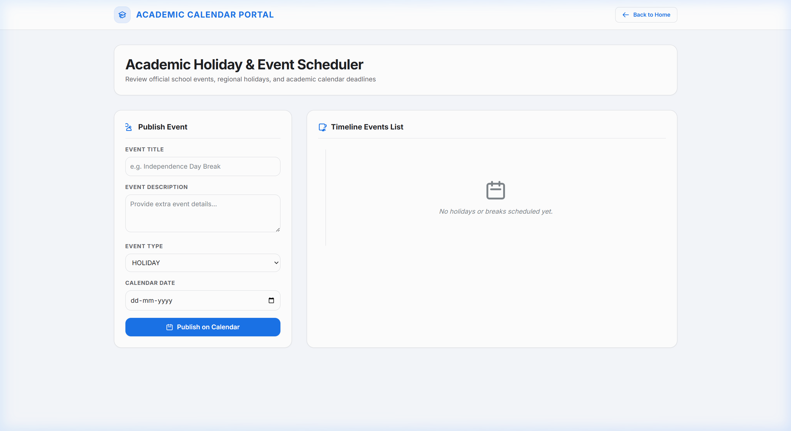
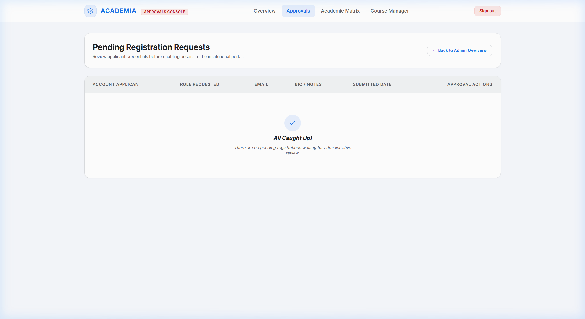

[](https://github.com/faizalzafri/academia/actions/workflows/maven.yml)

# Academia Platform

A modern, institutional-grade Academic Management & Governance System built with **Spring Boot**, **PostgreSQL**, **Liquibase**, and **Thymeleaf**. Designed with a clean, high-productivity bright UI theme, comprehensive Internationalisation (**i18n**) across 6 languages (including RTL), and rigorous academic lifecycle management.

---

## Visual UI Walkthrough & Key Workflows

Explore the core features and workflows of Academia Platform below:

### 1. Multilingual Authentication & Regionalisation (i18n)
Users can seamlessly toggle between **6 supported languages** (English, Spanish, French, German, Hindi, and Arabic) with automatic session/cookie persistence and native Right-to-Left (**RTL**) layout directionality for Arabic.

| Spanish Locale (`?lang=es`) | Arabic RTL Locale (`?lang=ar`) |
|---|---|
|  |  |

---

### 2. Principal Governance & Academic Session Lifecycle
The Principal Executive Board monitors high-level institutional health, real-time enrollment statistics, faculty-to-student ratios, and manages academic session transitions (`PLANNING` &rarr; `ACTIVE` &rarr; `COMPLETED`).



---

### 3. Academic Matrix & Scoped Role Assignment
Administrators and academic heads can search and filter the school's class sections across Grades 1 through 12. Teachers and student leaders (Class Captains and Sports Captains) are assigned with strict class-level scoping.

| Interactive Matrix Search & Filter | In-line Scoped Role Assignment |
|---|---|
|  |  |

---

### 4. Historical Academic Archive & Audits
Audit past academic sessions in an immutable, read-only retrospective mode. View class rosters, student enrollments, and teacher allocations without duplicate entries.



---

### 5. Extra-Curricular Activities Subsystem
Coordinates Sports Day, Annual Gala performances, Farewell ceremonies, Prom dances, and House Tournaments. Students register for events, and teachers record scores and podium winners.



---

### 6. Institutional Academic Calendar
A centralized calendar keeping faculty, staff, and students aligned on examinations, semester milestones, holidays, and campus events.



---

### 7. User Registration & Administrator Approval Workbench
Self-service onboarding with separate flows for Students and Teachers. Newly registered accounts remain in `PENDING` state until reviewed and activated by an Administrator.



---

## Functional Overview

### User Roles

| Role | Description |
|------|-------------|
| **PRINCIPAL** | Institutional governance: starts/concludes academic years, bulk promotes student cohorts, reviews session audits & historical archives |
| **SYSTEM_ADMIN** | Approves/rejects registrations, manages academic structure, assigns roles, technical administration |
| **TEACHER** | Manages courses & syllabi, uploads study materials, coordinates activities & records results, views timetable & calendar |
| **STUDENT** | Views enrolled courses, downloads materials, registers for extra-curricular activities, accesses class timetable & chatroom |

### Core Modules

- **Academic Year Sessions Lifecycle** — Create upcoming sessions in `PLANNING` state, transition to `ACTIVE`, and conclude with `COMPLETED`/`ARCHIVED` status.
- **Bulk Cohort Promotion & Alumni Tracking** — Automatically promote students to the next grade class across academic sessions, while marking graduating Class 12 students as Alumni.
- **Historical Data Archive** — Audit past sessions' class rosters, student enrollments, and teacher assignments in immutable read-only mode.
- **Principal Governance Dashboard** — High-level institutional metrics, session audit reports, and staff-to-student ratio tracking.
- **Extra-Curricular Activities Subsystem** — Plan, manage, and register for Sports Day, Annual Day, Farewell ceremonies, Prom dances, and House competitions. Record podium winners, medals, and scores.
- **Registration & Approval Workflow** — Role-based onboarding where Student and Teacher accounts require admin approval before activation.
- **Course Management & Syllabi** — Teachers create and manage courses; students browse course catalog and view study resources.
- **Academic Matrix & Timetable Builder** — Class/section assignment with real-time teacher double-booking conflict detection.
- **School Calendar & Real-Time Chatroom** — Institutional calendar events and WebSocket-powered STOMP chatroom.
- **Full Internationalisation (i18n)** — Dynamic multi-language support (EN, ES, FR, DE, HI, AR) with cookie persistence and RTL layout.

### Default Credentials

```
Admin:      admin     / Password123!
Principal:  principal / Password123!
```

---

## Tech Stack

| Layer | Technology |
|-------|-----------|
| **Framework** | Spring Boot 3.4.3 / Java 17 |
| **Database** | PostgreSQL 14+ (H2 in-memory for testing) |
| **ORM & Data** | Spring Data JPA / Hibernate |
| **Schema Migration** | Liquibase (SQL-based changesets) |
| **UI & Styling** | Thymeleaf, Modern Clean Bright Theme, Tailwind CSS |
| **Security** | Spring Security (BCrypt password encoding, RBAC) |
| **i18n / Localization** | Spring `CookieLocaleResolver`, `LocaleChangeInterceptor`, Resource Bundles |
| **Real-time Messaging** | Spring WebSocket + STOMP |
| **Testing & Quality** | JUnit 5, Spring Boot Test, JaCoCo |
| **Build Tool** | Maven Wrapper (`./mvnw`) |

---

## Project Structure

```
studentManagement/
├── src/main/java/com/academia/platform/
│   ├── config/          # Security, WebSocket, WebMvc (i18n), Liquibase config
│   ├── controller/      # REST & MVC controllers (Auth, Academic, Activity, Principal, etc.)
│   ├── dto/             # Data Transfer Objects
│   ├── model/           # JPA entities (User, Student, Teacher, Course, SchoolClass, etc.)
│   ├── repository/      # Spring Data JPA repositories
│   ├── service/         # Business logic services
│   ├── validator/       # Custom validators
│   └── listener/        # Event listeners
│
├── src/main/resources/
│   ├── db/changelog/    # Liquibase SQL migration scripts
│   ├── messages*.properties # i18n Resource bundles (en, es, fr, de, hi, ar)
│   ├── templates/       # Thymeleaf HTML views
│   ├── static/          # CSS, JS, and static assets
│   └── application.properties
│
├── docs/
│   └── screenshots/     # Visual documentation and walkthrough screenshots
└── pom.xml
```

---

## Quick Start & Setup

### Prerequisites

- **Java 17+** (`JAVA_HOME` pointing to JDK 17)
- **PostgreSQL 14+** running locally on port `5432` with database `academiadb`
- **Maven 3.8+** (or use `./mvnw` / `mvnw.cmd`)

---

## Maven Commands

### Build & Run

```bash
# Compile the project
./mvnw clean compile

# Run the application locally
./mvnw spring-boot:run

# Package as executable JAR
./mvnw clean package

# Run the packaged JAR
java -jar target/academia-platform-0.0.1-SNAPSHOT.jar
```

### Running Tests

```bash
# Run entire test suite (unit + integration on in-memory H2)
./mvnw clean test

# Run a specific test class
./mvnw test -Dtest=RegistrationAndApprovalIntegrationTest

# Generate JaCoCo code coverage report
./mvnw clean test jacoco:report
```

---

## Database Configuration

Key settings in `src/main/resources/application.properties`:

| Property | Value | Description |
|----------|-------|-------------|
| `spring.datasource.url` | `jdbc:postgresql://localhost:5432/academiadb` | Database connection URL |
| `spring.datasource.username` | `postgres` | DB username |
| `spring.datasource.password` | `postgres` | DB password |
| `spring.jpa.hibernate.ddl-auto` | `validate` | Hibernate validates schema against Liquibase |
| `spring.liquibase.enabled` | `true` | Liquibase automatically runs migrations on startup |

---

## License

This project is open-source and licensed under the **[MIT License](LICENSE)**. Feel free to use, modify, and distribute it for personal, academic, or commercial projects.
